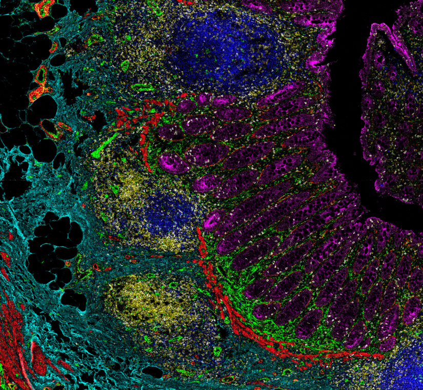

# timct (Tyler’s IMC Tools) <a href="https://github.com/BCC-Biostats/timct"></a>

[](https://opensource.org/licenses/MIT)


## Overview

Tyler’s IMC Tools is a package that is meant to provide some IMC
functions to help with analysis

## Installation

To install the package, run the following commands:

``` r
if (!require("remotes")) install.packages("remotes")
remotes::install_github("BCC-Biostats/timct")   
```

### mean_pixel_intensity

Function to calculate the mean pixel intensity around each cell in a
given image.

Input a dataframe of cell x/y coordinates and a dataframe of pixel x/y
coordinates with their intensity and the function will return a
dataframe with the mean pixel intensity around each cell.

``` r
# Load in data
spe <- readRDS("data/derived_data/spe_9_neighborhoods_2.rds")
cancer_EA9_ROI_003 <- read_tsv("../MCD data/Cancer/FFPE_40Marker_MsKidney_EA9_11-30-202-MCD/20231201_ROI_003_3.txt")

# Get just the pixels coords and value
pixels <- cancer_EA9_ROI_003 |> 
  select(X, Y, `CollagenI(Yb173Di)`) |>
  dplyr::rename(x = X,
                y = Y,
                value = `CollagenI(Yb173Di)`)

# pull_off the EA9 image 3
spe_ea9_3 <- spe[, spe$sample_id %in% "EA9_ROI_003"]

# get just the x/y coordinates of the cells
cells <- spatialCoords(spe_ea9_3) |> 
  as.data.frame() |> 
  dplyr::rename(x = X_position, y = Y_position)

# Run average_pixel_intensity
mean_pixel_intensity <- timct::average_pixel_intensity(cells, pixels, 14)

# what is returned
mean_pixel_intensity |> 
  head()

# how many are returned
mean_pixel_intensity |> 
  length()
```
